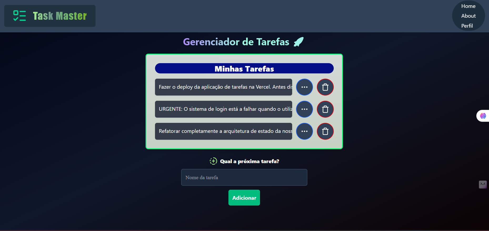
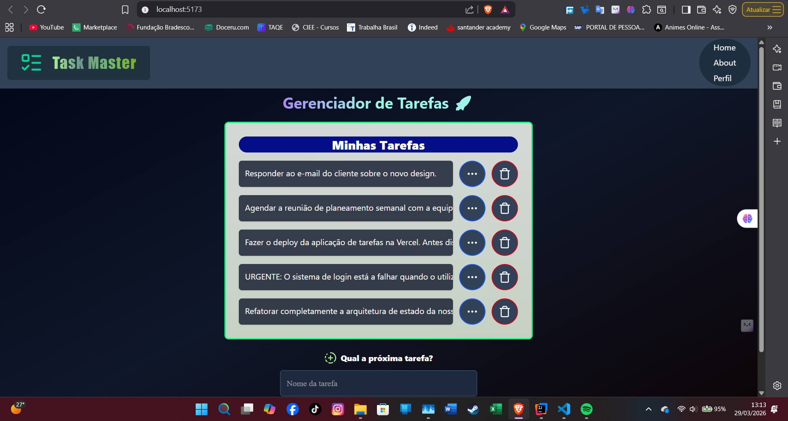
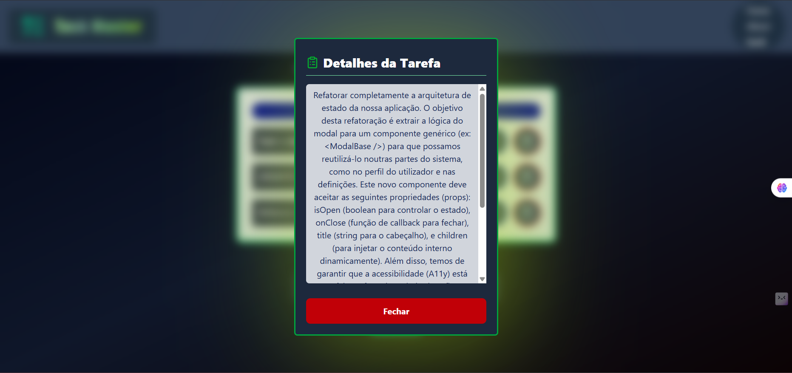

# 🚀 Task Master - Gestão de Tarefas Inteligente


O **Task Master** é um ecossistema moderno de gestão de tarefas diárias que une uma interface Dark Mode imersiva a uma lógica de estado robusta. O projeto foi desenvolvido como um marco no aprofundamento em **React e Front-end Avançado**, aplicando conceitos de componentização, hooks (`useState`, `useEffect`), design responsivo fluido e persistência de dados.

---

## 🖼️ Preview do Sistema (Vertical Stack)

### 1. Ecrã Principal de Tarefas
A interface inicial oferece um ponto de partida limpo, focado na produtividade com validação de campos em tempo real.


---

### 2. Variação Visual e Estados Dinâmicos
Itens concluídos alteram visualmente o seu estado (riscados e opacos) sem poluir a lista principal.


---

### 3. Modal de Leitura Focada (Scroll Inteligente)
Textos gigantescos são contidos num modal responsivo que trava o fundo do ecrã (body scroll lock), garantindo a leitura sem quebrar o layout.


---

## 🎯 O Problema que o Task Master Resolve

Na gestão de tarefas diárias, aplicativos genéricos costumam sofrer de interfaces poluídas, falta de responsividade em textos longos e perda de informações se o utilizador não tiver uma conta.

O **Task Master** foi desenhado para atacar estes pontos diretamente:

### 1. Caos Mental vs. Foco Centralizado
- **Problema:** O utilizador perde-se em listas intermináveis ou esquece o que precisa de ser feito.
- **Solução:** Uma interface limpa (Dark Mode) que destaca a ação de adicionar tarefas e fornece um "Empty State" amigável quando a caixa está vazia.

### 2. Textos Gigantes a Quebrar o Layout vs. Modal Inteligente
- **Problema:** Ao colar uma tarefa enorme (como logs de erro ou textos de reunião), a lista deforma-se e empurra botões para fora do ecrã.
- **Solução:** A lista corta textos longos com `truncate`. Para leitura completa, um Modal é aberto com `max-h-[85vh]`, limitando a altura e criando um scroll vertical interno elegante, enquanto o scroll geral da página é desativado via `useEffect`.


---

## ✨ Funcionalidades "Real-World"

- **Bloqueio de Scroll Global:** O hook `useEffect` manipula o `document.body` para remover a barra de rolamento principal sempre que o Modal é invocado.
- **Efeitos de Drop-Shadow:** Diferente de `box-shadow`, o sistema utiliza filtros de drop-shadow para criar um efeito de neon perfeito nos ícones SVG de exclusão e detalhes.
- **Responsividade Adaptativa:** Uso de Viewport Units (`vw`, `vh`) para garantir que os modais e contentores se ajustem desde um telemóvel estreito até um monitor Ultrawide.
- **Empty State UI:** Feedback visual instantâneo se a lista de tarefas for esvaziada.

---

## 🛠️ Tech Stack

| Camada | Tecnologia |
| :--- | :--- |
| **Estrutura & Core** | React (v19+) via Vite |
| **Estilização** | Tailwind CSS (Utility-First) |
| **Lógica de Estado** | JavaScript (ES6+) com Hooks (`useState`, `useEffect`) |
| **Ícones** | Lucide React |

---

## 🧠 Evolução Técnica

Este projeto marcou a consolidação do meu conhecimento em desenvolvimento de Interfaces (Front-end). Após construir lógicas complexas com Vanilla JS, o desafio aqui foi dominar o "Jeito React" de pensar: criar **Componentes isolados** (como `<Tasks />`), passar informações via **Props**, gerir a reatividade do DOM com **States** e criar efeitos colaterais inteligentes com **Hooks**. Após esse período de foco, construí este sistema.

---

## 🏗️ Como Executar

1. Clone o repositório:
   ```bash
   git clone [https://github.com/Jayzmatos22/Task-Master-react](https://github.com/Jayzmatos22/Task-Master-react)

---

## 📁 Estrutura de pastas
<pre>
📦 PROJECT-RC
├── 📁 public                 # Favicon e assets públicos
├── 📁 src                    # Código-fonte principal
│   ├── 📁 assets             # Capturas de tela para documentação
│   │   ├── 🖼️ detailedTask.png
│   │   ├── 🖼️ indexTask.png
│   │   └── 🖼️ indexTask2.png
│   ├── 📁 components         # Componentes reutilizáveis
│   │   ├── ⚛️ EdgeTopApp.jsx # Barra superior de navegação
│   │   ├── 🎨 Tasks.css      # Estilizações específicas (Scrollbar, glow)
│   │   └── ⚛️ Tasks.jsx      # Componente responsável pela listagem e Modais
│   ├── 🎨 App.css            # Estilos estruturais da app
│   ├── ⚛️ App.jsx            # Pai (Gestor do State e LocalStorage)
│   ├── 🎨 index.css          # Injeção das diretivas do Tailwind
│   └── ⚛️ main.jsx           # Ponto de entrada do React no DOM
├── 📄 .gitignore             # Ficheiros e pastas ignoradas pelo Git (node_modules)
├── 📄 package.json           # Dependências e scripts
├── 📄 tailwind.config.js     # Configurações do Tailwind
└── 📄 vite.config.js         # Configurações do Bundler